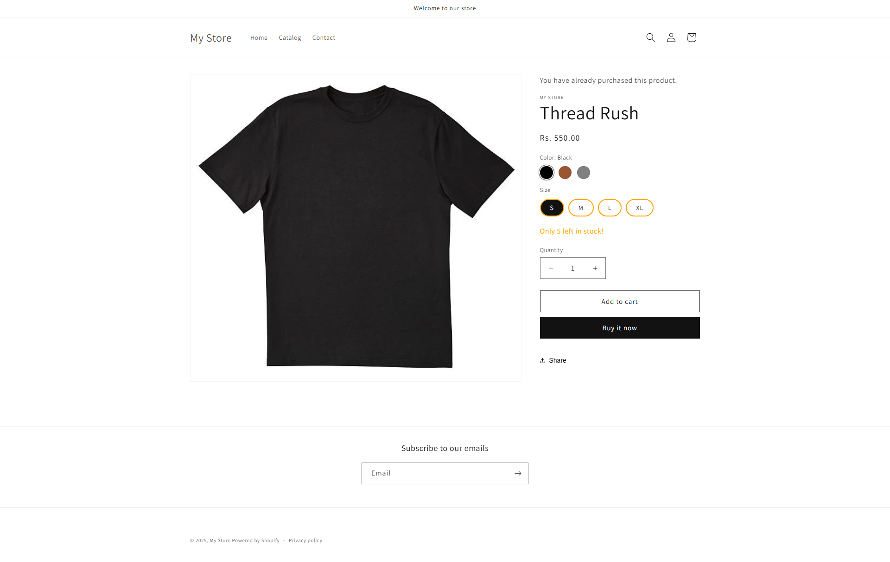
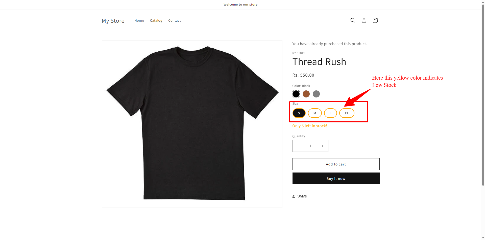
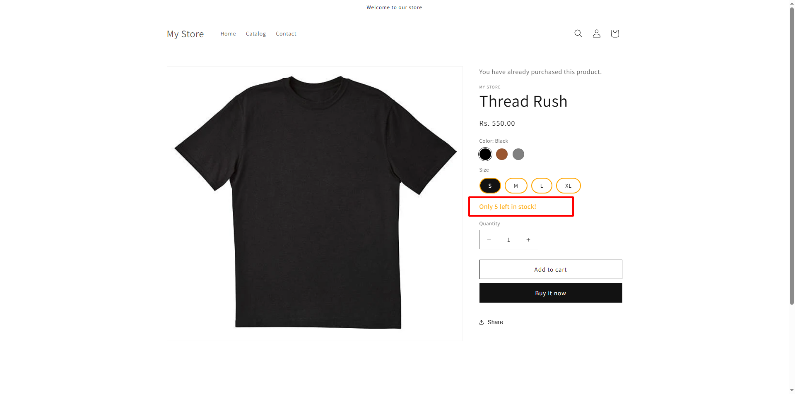
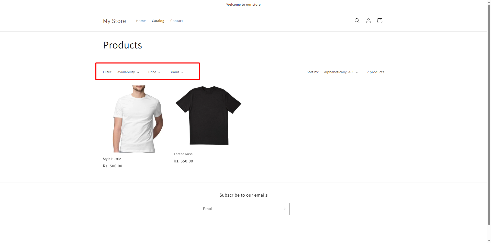
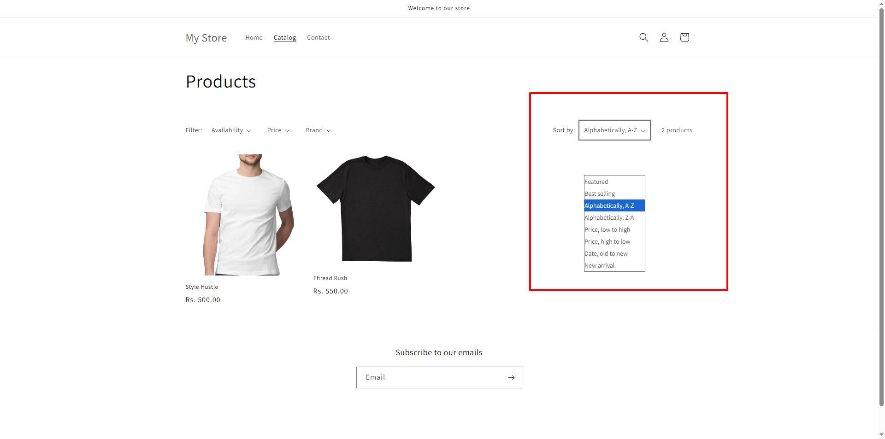

# 🛍️ Shopify Theme Customisation – Practical Submission

## 📌 Project Overview
This project is a customised Shopify theme for a clothing store.  
The main objective was to enhance the **Product Detail Page** (PDP) and **Product Listing Page** (PLP) with additional UI/UX features, filtering, and stock-based logic.  

All customisations were implemented at the **theme level** and pushed to a GitHub repository for submission.

---

## ✨ Features Implemented

### **1. Product Detail Page (PDP)**
- **Color variants as clickable swatches**
  - Replaced default variant dropdown with clickable color swatches.
  - Automatically updates product images when a color variant is selected.
  
- **Size availability with visual indicators**
  - Shows size options as clickable pills (radio buttons).
  - Availability states:
    - ✅ **Available** – In stock
    - ⚠️ **Low Stock** – Inventory < 10
    - ❌ **Out of Stock** – Disabled & marked as unavailable

- **Dynamic stock messages**
  - `"Only X left in stock"` – shown when stock is less than 10.
  - `"Back in stock soon"` – shown when stock is 0.
  
- **Image updates on color selection**
  - Selecting a color changes the featured product image set to match that variant.

- **"You bought this before" message**
  - Displays if a logged-in user has purchased that exact product variant in the past.

---

### **2. Product Listing Page (PLP)**
- **Advanced filtering**
  - **Price**
  - **Vendor / Brand**
  - **In Stock only** (hides out-of-stock products)
  - Filters work **in correlation** with each other.

- **Sorting options**
  - Price – Low to High
  - Price – High to Low
  - New Arrivals

---

## 🛠️ Technical Implementation
- **JavaScript & jQuery**
  - Used for variant selection, stock indicator logic, and dynamic updates.
- **Shopify Liquid**
  - Modified templates & snippets for product options, inventory checks, and customer order history detection.
- **Theme customisation**
  - Adjusted CSS for visual swatches, size pills, and stock labels.
- **Metafields**
  - Used where necessary for additional product attributes.
- **Inventory data injection**
  - Enhanced `window.variants` to include `inventory_quantity`.

---


---

## 🖼️ Screenshots

### **Product Detail Page**
| Feature | Screenshot |
|---------|------------|
| Color Swatches |  |
| Size Pills with Stock Indicators |  |
| Stock Messages |  |

### **Product Listing Page**
| Feature | Screenshot |
|---------|------------|
| Filters |  |
| Sorting Options |  |

---

## 🌐 Live Store Preview
You can view the theme customisations live here:  
🔗 **Collection Page URL:** (https://4tbs90-dp.myshopify.com/collections/all)  
🔗 **Product Page URL:** (https://4tbs90-dp.myshopify.com/products/thread-rush)  

> ⚠️ If the store is password protected, please provide the password below:  
**Password:** `eshump`

---

## 🚀 Setup Instructions
1. Clone the repository:
   ```bash
   (https://github.com/rochaniashish-ops/ashish-rochani-shopify-techerudite-practical.git)
2. Upload the theme to your Shopify store via Online Store → Themes → Upload Theme.
3. Assign the theme to your store preview.
4. Test the PDP and PLP features with different products & inventory levels.
